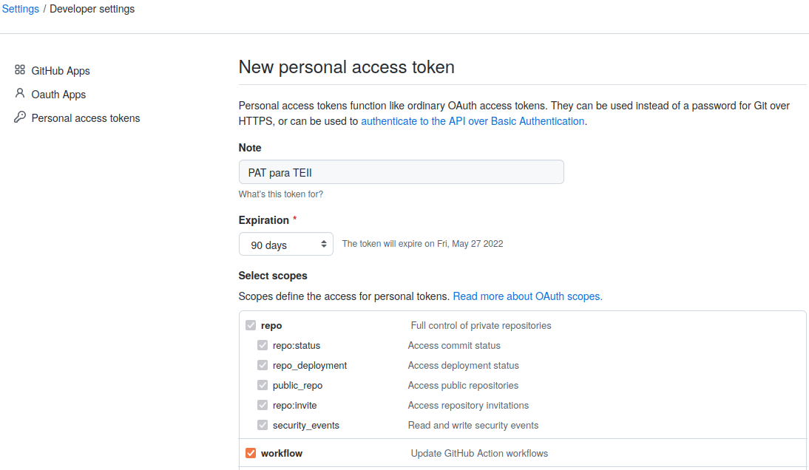
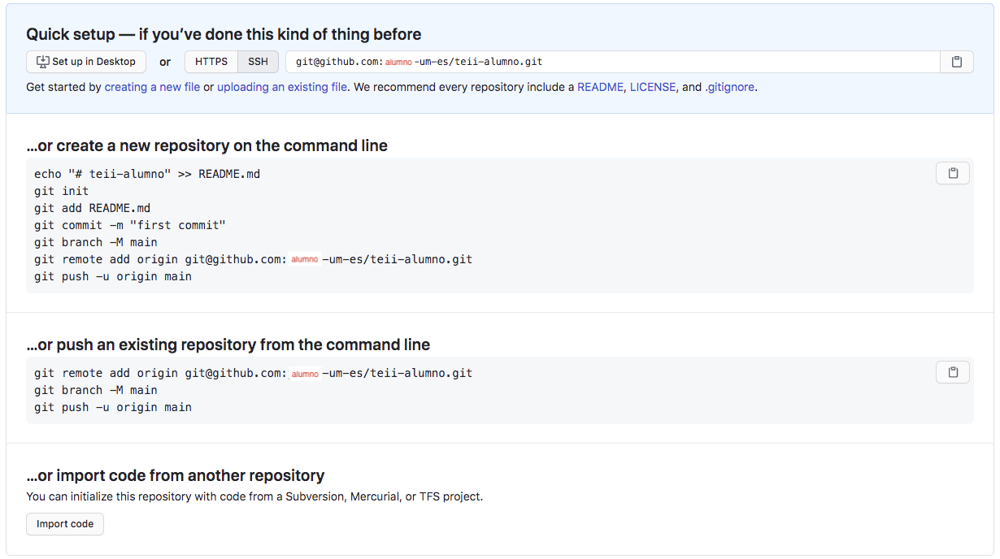

# Tecnologías Específicas en Ingeniería Informática • Configuración de GitHub

- [Tecnologías Específicas en Ingeniería Informática • Configuración de GitHub](#tecnologías-específicas-en-ingeniería-informática--configuración-de-github)
  - [Creación de una cuenta en GitHub](#creación-de-una-cuenta-en-github)
  - [Configuración de acceso a GitHub mediante un token de acceso personal](#configuración-de-acceso-a-github-mediante-un-token-de-acceso-personal)
  - [Creación de un repositorio para TEII en GitHub](#creación-de-un-repositorio-para-teii-en-github)
  - [Configuración de Extensión GitHub Pull Requests and Issues](#configuración-de-extensión-github-pull-requests-and-issues)
  - [Referencias](#referencias)
    - [GitHub](#github)
    - [GitHub y Markdown](#github-y-markdown)
    - [GitHub y Visual Studio Code](#github-y-visual-studio-code)
    - [Alternativas a GitHub](#alternativas-a-github)

___

## Creación de una cuenta en GitHub

Accede a [github.com • SignUp](https://github.com/join?ref_cta=Sign+up&ref_loc=header+logged+out&ref_page=%2F&source=header-home)
y crea una cuenta con tu nombre, apellidos y dirección de correo electrónico de
la UMU.

:warning: Si tu dirección de correo electrónico es `alumno@um.es`, el nombre de
usuario debe ser `alumno-um-es`.

## Configuración de acceso a GitHub mediante un token de acceso personal

Genera un token de acceso personal siguiendo [estas
instrucciones](https://docs.github.com/es/authentication/keeping-your-account-and-data-secure/creating-a-personal-access-token).

<!-- markdownlint-disable MD013 -->
```text
github.com • Settings - Developers settings : Personal access tokens : Generate new token
                        Note (PAT para TEII)
                        Expiration (90 days)
                        Select Scopes (repo y workflow)
```
<!-- markdownlint-enable MD013 -->

Para terminar, establece tu nombre y apellido(s) en GitHub:

```text
github.com • Settings : Profile : Public Profile : Name : Nombre Apellido1 [Apellido2]
```



Para más detalles acerca de otras formas de accesso, véase la referencia *About
Authentication to GitHub*.

## Creación de un repositorio para TEII en GitHub

```text
github.com • Repositories - New : Repository Name (teii-alumno)
                                  Description (Nombre Apellido1 [Apellido2])
                                  Private
```

:warning: El repositorio debe ser privado.



Para *clonar* el repositorio remoto en local desde la línea de órdenes:

<!-- markdownlint-disable MD013 -->
```bash
$ cd $HOME/TEII
$ git clone git@github.com:alumno-um-es/teii-alumno.git
Cloning into 'teii-alumno'...
Warning: Permanently added the RSA host key for IP address 'IP_ADDRESS' to the list of known hosts.
warning: You appear to have cloned an empty repository.
```
<!-- markdownlint-enable MD013 -->

Para *clonar* el repositorio remoto en local desde Visual Studio Code:

```text
Visual Studio Code • CONTROL DE CÓDIGO FUENTE : Clone (git@github.com:alumno-um-es/teii-alumno.git)
```

Creación del fichero `README.md` en el repositorio `teii-alumno` desde la línea
de órdenes:

```bash
$ cd teii-alumno
$ echo -e "# TEII\n\n- Nombre Apellido1 [Apellido2]" > README.md
$ git add README.md
$ git commit -m "Creación de README.md"
$ git push --set-upstream origin master
```

Modificación del fichero `README.md` en el repositorio `teii-alumno` desde
Visual Studio Code:

<!-- markdownlint-disable MD013 -->
```text
Visual Studio Code • EXPLORADOR : Edit (Añade el segundo miembro del grupo a README.md)
Visual Studio Code • CONTROL DE CÓDIGO FUENTE : Add / Commit ("Modificación de README.md") / Push
```
<!-- markdownlint-enable MD013 -->

:warning: Verifica en `github.com` que los dos *commits* han sido actualizados
en el repositorio remoto con éxito.

Finalmente, comparte tu repositorio con los profesores de la asignatura:

<!-- markdownlint-disable MD013 -->
```text
github.com • alumno-um-es/teii-alumno : Settings : Manage access : Add juanf-um-es & rtitos-um-es.
```
<!-- markdownlint-disable MD013 -->

## Configuración de Extensión GitHub Pull Requests and Issues

```text
Visual Studio Code • GITHUB : Sign In
```

## Referencias

### GitHub

- [github.com • GitHub Docs](https://docs.github.com/en/github)

- [github.com • Authentication • About Authentication to GitHub](https://docs.github.com/en/github/authenticating-to-github/about-authentication-to-github)

  - [Authenticating with the command line](https://docs.github.com/en/github/authenticating-to-github/about-authentication-to-github#authenticating-with-the-command-line)

  - [Creating a Personal Access Token](https://docs.github.com/en/authentication/keeping-your-account-and-data-secure/creating-a-personal-access-token)

### GitHub y Markdown

- [guides.github.com • Mastering Markdown](https://guides.github.com/features/mastering-markdown/)
[[PDF](https://guides.github.com/pdfs/markdown-cheatsheet-online.pdf)]

### GitHub y Visual Studio Code

- [code.visualstudio.com • Working with GitHub in VS Code](https://code.visualstudio.com/docs/editor/github)

### Alternativas a GitHub

- [BitBucket](https://www.bitbucket.org)
- [GitLab](https://www.gitlab.com)
