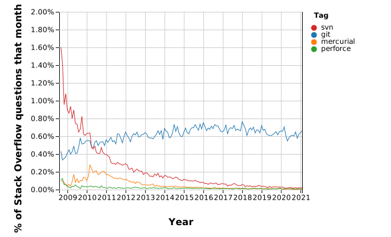
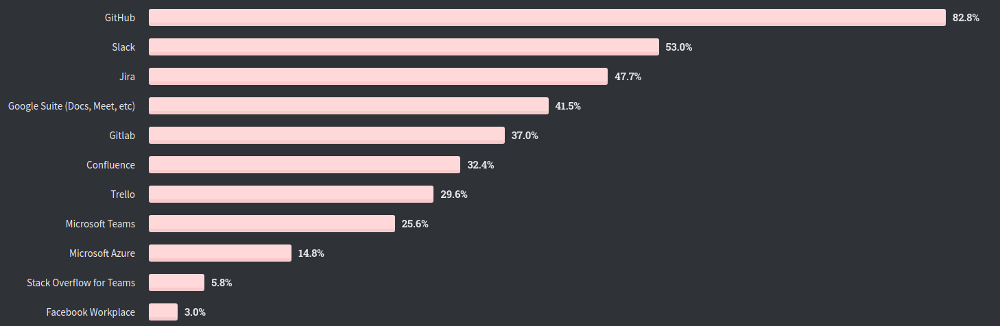
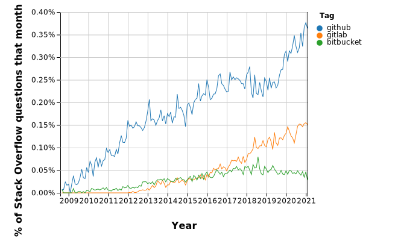
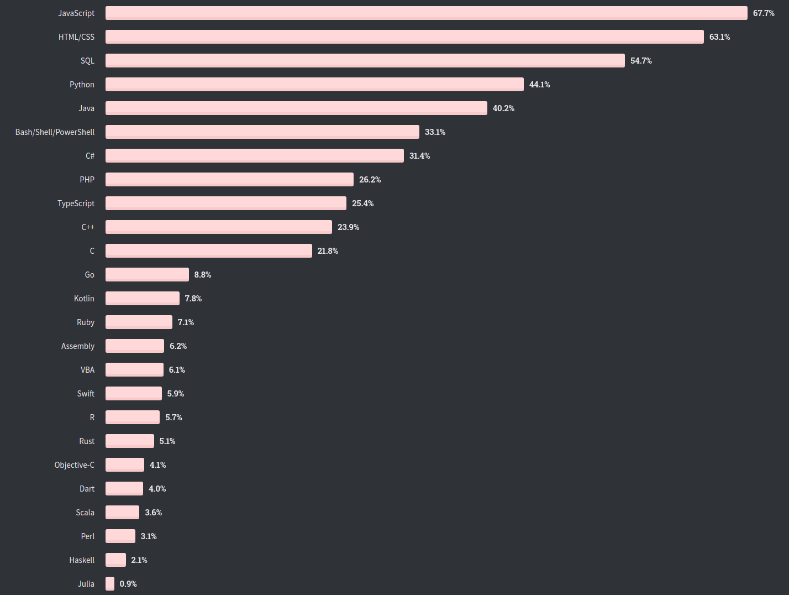
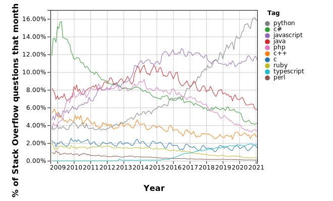

# Tecnologías Específicas en Ingeniería Informática • Presentación

- [Tecnologías Específicas en Ingeniería Informática • Presentación](#tecnologías-específicas-en-ingeniería-informática--presentación)
  - [Contenidos](#contenidos)
    - [Desarrollo de una Aplicación Sencilla con CI/CD](#desarrollo-de-una-aplicación-sencilla-con-cicd)
    - [¿Por qué `git`?](#por-qué-git)
      - [Stack Overflow Trends](#stack-overflow-trends)
    - [¿Por qué GitHub?](#por-qué-github)
      - [Stack Overflow Survey - Collaboration Tools](#stack-overflow-survey---collaboration-tools)
      - [Stack Overflow Trends - Collaboration Tools](#stack-overflow-trends---collaboration-tools)
    - [¿Por qué Python?](#por-qué-python)
      - [Stack Overflow Survey - Programming, Scripting, and Markup Languages](#stack-overflow-survey---programming-scripting-and-markup-languages)
      - [Stack Overflow Trends - Programming, Scripting, and Markup Languages](#stack-overflow-trends---programming-scripting-and-markup-languages)
  - [Aulas, planificación y profesorado](#aulas-planificación-y-profesorado)
  - [Evaluación](#evaluación)
  - [Preguntas Frecuentes](#preguntas-frecuentes)
  - [Referencias](#referencias)

## Contenidos

### Desarrollo de una Aplicación Sencilla con CI/CD

En la industria, el desarrollo de una aplicación suele llevarlo a cabo un equipo
de múltiples desarrolladores que trabajan en nuevas funciones de manera
simultánea. Todos los cambios realizados deben integrarse y probarse antes de
generar una nueva versión de la aplicación. Tradicionalmente, este proceso era
poco frecuente y, en consecuencia, no sólo tedioso sino arduo, lento y difícil.
**CI/CD** es una estrategia de desarrollo de software usada en la industria que
consiste integrar, probar y publicar una aplicación, a partir los cambios de los
desarrolladores, con frecuencia y de manera automatizada.

- ***Continuous Integration* (CI)**: Proceso que detecta cambios en un
  repositorio de código fuente, obtiene una copia del mismo, construye la
  aplicación y ejecuta una secuencia de tests unitarios, de integración o de
  otra índole.

- ***Continuous Delivery* (CD)**: Proceso que, a partir del paso anterior,
  genera una nueva versión de la aplicación. El producto resultante suele ser un
  archivo ejecutable, un paquete o módulo que se puede instalar, o una imagen
  `docker`.

En esta asignatura, ilustraremos como construir una aplicación Python sencilla,
distribuida como un paquete Python, utilizando **`git`** como sistema de control
de versiones y **GitHub** como plataforma para la automatización de CI/CD.

### ¿Por qué `git`?

#### Stack Overflow Trends

Porcentaje de preguntas en Stack Overflow con las etiquetas `git`, `mercurial`,
`perforce` o `svn`:

### ¿Por qué GitHub?

#### Stack Overflow Survey - Collaboration Tools

El 82,8% de los desarrolladores que cumplimentaron la encuesta utiliza GitHub
como herramienta de colaboración:

#### Stack Overflow Trends - Collaboration Tools

Porcentaje de preguntas en Stack Overflow con las etiquetas `github`, `gitlab` o
`bitbucket`:

### ¿Por qué Python?

#### Stack Overflow Survey - Programming, Scripting, and Markup Languages

El 44,1% de los desarrolladores que cumplimentaron la encuesta utiliza Python:

#### Stack Overflow Trends - Programming, Scripting, and Markup Languages

Porcentaje de preguntas en Stack Overflow con las etiquetas `c`, `c++`, `c#`,
`java`, `javascript`, `perl`, `php`, `python`, `ruby` o `typescript`:

## Aulas, planificación y profesorado

El carácter eminentemente práctico de los bloques III y IV de la asignatura hace
que se siga la misma metodología docente en todas las sesiones presenciales sin
distinción entre teoría y de prácticas, ya que será necesario el uso del
ordenador por parte del alumno para ir siguiendo el desarrollo de la clase. Por
este motivo, **a partir del 17 de Marzo la clase de los jueves tendrá lugar en
el laboratorio 1.0 de la Facultad de Informática** en vez de en el aula A.01 del
Aulario Norte. Las sesiones de prácticas de martes y miércoles no cambian de
ubicación (laboratorio 2.1).

Los contenidos de esta parte de la asignatura se pueden dividir a grandes rasgos
en dos bloques, cada uno de los cuales tiene una duración de tres semanas y es
impartido por un profesor diferente.

- **Bloque III**: Tutoriales de Git, *workflow* de GitHub, Python y análisis de
  datos en Python con el paquete Pandas.
  - Profesor: **José Rubén Titos Gil**.
    - Tutorías presenciales (con cita previa): Martes: 15:30-18:30, despacho
      3.03 FIUM.
    - Tutorías electrónicas: Mensaje por el AV o Zoom.
- **Bloque IV**: Extensión de un proyecto software sencillo en Python con
  Pandas mediante el *workflow* de GitHub.
  - Profesor: **Juan Fernández Peinador**
    - Tutorías presenciales (con cita previa): Viernes: 9:00-10:30, despacho
      3.32 FIUM.
    - Tutorías electrónicas: Mensaje por el AV o Zoom.

## Evaluación

La evaluación de esta parte de la signatura consiste en una única tarea que
incluye:

- [**2,0 puntos**] Ejercicios de programación Python básicos (incluyendo POO).
- [**8,0 puntos**] Extensión de un proyecto software sencillo en Python.

Para la realización y entrega de la tarea se formarán **grupo de prácticas de
dos alumnos**.

La fecha límite para la entrega de la tarea es el **8 de mayo**.

Para superar esta parte de la asignatura hay que obtener una **calificación \>=
5**.

## Preguntas Frecuentes

- **¿Qué infraestructura necesito para esta asignatura?**
  
  Tanto las clases, teóricas o prácticas, como el proyecto software de esta
  asignatura requieren una instalación nativa o una máquina virtual de **Ubuntu
  20.04 LTS**.

  Una máquina virtual para VirtualBox de [**Xubuntu 20.04
  LTS**](https://xubuntu.org/) está disponible en UMUbox (enlace disponible en
  el Aula Virtual). Esta máquina virtual es similar a Ubuntu 20.04 LTS pero
  necesita menos recursos (2 GB de memoria y ~10 GB de disco). Su instalación
  requiere tanto VirtualBox como VirtualBox *Extension Pack* que se pueden
  obtener [aquí](https://www.virtualbox.org/wiki/Downloads). El usuario es
  `alumno` y su clave `alumno`.

- **¿No puedo seguir las clases y realizar la tarea en Fedora, Mac OS o Windows?**

  Sí, ambas cosas se pueden hacer en Fedora (u otra distribución de Linux), Mac
  OS o incluso en Windows con WSL. No obstante, el alumno es responsable de la
  configuración de todas las herramientas necesarias en esos entornos.

- **¿No puedo desarrollar y entregar la tarea individualmente?**

  El proyecto software debería involucrar a un grupo de dos alumnos, puesto que
  uno de los objetivos principales es desarrollar un componente software
  siguiendo un *workflow* usado en la industria para trabajo en equipo. Por
  ello, se recomienda encarecidamente que forméis grupos de prácticas de dos
  alumnos. No obstante, si por cualquier motivo no fuese posible, se admitirá la
  entrega de la tarea individualmente. Téngase en cuenta que la carga de trabajo
  y los criterios de evaluación serán idénticos independientemente de la
  composición del grupo de prácticas.

## Referencias

- [opensource.com • What is CI/CD?](https://opensource.com/article/18/8/what-cicd)
- [RedHat • DevOps - What is CI/CD?](https://www.redhat.com/en/topics/devops/what-is-ci-cd)

- [Stack Overflow Developer Survey'20](https://insights.stackoverflow.com/survey/2020):
  Encuesta a ~65000 desarrolladores de 185 países realizada en Febrero de 2020.
  - [Stack Overflow Developer Survey'20 • Collaboration Tools](https://insights.stackoverflow.com/survey/2020#technology-collaboration-tools)
  - [Stack Overflow Developer Survey'20 • Programming, Scripting and Markup Languages](https://insights.stackoverflow.com/survey/2020#technology-programming-scripting-and-markup-languages)

- [Stack Overflow Trends](https://insights.stackoverflow.com/trends):
  Estadísticas sobre etiquetas en preguntas en Stack Overflow.
  - [Stack Overflow Trends • Collaboration Tools](https://insights.stackoverflow.com/trends?tags=github%2Cgitlab%2Cbitbucket)
  - [Stack Overflow Trends • Programming Languages](https://insights.stackoverflow.com/trends?tags=c%2Cc%2B%2B%2Cc%23%2Cjava%2Cjavascript%2Cperl%2Cphp%2Cpython%2Cruby%2Ctypescript)
  - [Stack Overflow Trends • Version Control Systems](https://insights.stackoverflow.com/trends?tags=git%2Cmercurial%2Cperforce%2Csvn)
